# 01 深入 JavaScript 运行原理

:::tip 前端需要掌握的三大技术
前端开发最主要需要掌握的是三个知识点：HTML、CSS、JavaScript

- HTML: 简单易学，掌握常用的标签即可；
- CSS: CSS 属性规则较多，多做练习和项目；
- JavaScript: 上手容易，但是精通很难。 学会它需要几分钟，掌握它需要很多年。
  :::

## JavaScript 的重要性

- JavaScript 是前端万丈高楼的根基

  前端行业在近几年快速发展，并且开发模式、框架越来越丰富。
  但是不管你学习的是 Vue、React、Angular，包括 jQuery，以及一些新出的框架。
  他们本身都是基于 JavaScript 的，使用他们的过程中你都必须好好掌握 JavaScript。
  所以 JavaScript 是我们前端万丈高楼的根基，无论是前端发展的万丈高楼，还是我们筑建自己的万丈高楼

- JavaScript 在工作中至关重要
  在工作中无论你使用什么样的技术，比如 Vue、React、Angular、uniapp、taro、ReactNative。
  也无论你做什么平台的应用程序，比如 pc web、移动端 web、小程序、公众号、移动端 App。
  它们都离不开 JavaScript，并且深入掌握 JavaScript 不仅可以提高我们的开发效率，也可以帮助我们快速解决在开发中遇到
  的各种问题。
  所以往往在面试时（特别是高级岗位），往往会考察更多面试者的 JavaScript 功底。
- 前端的未来依然是 JavaScript

  在可预见的前端的未来中，我们依然是离不开 JavaScript 的。
  目前前端快速发展，无论是框架还是构建工具，都像雨后春笋一样，琳琅满目。
  而且框架也会进行不断的更新，比如 vue3、react18、vite2、TypeScript4.x。
  前端开发者面对这些不断变化的内容，往往内心会有很多的焦虑，但是其实只要我们深入掌握了 JavaScript，这些框架或者工具都
  是离不开 JavaScript 的

## 著名的 Atwood 定律

Stack Overflow 的创立者之一的 Jeff Atwood 在 2007 年提出了著名的 Atwood(阿特伍德) 定律：

> Any application that can be written in JavaScript, will eventually be written in JavaScript.
> 任何可以使用 JavaScript 来实现的应用都最终都会使用 JavaScript 实现。

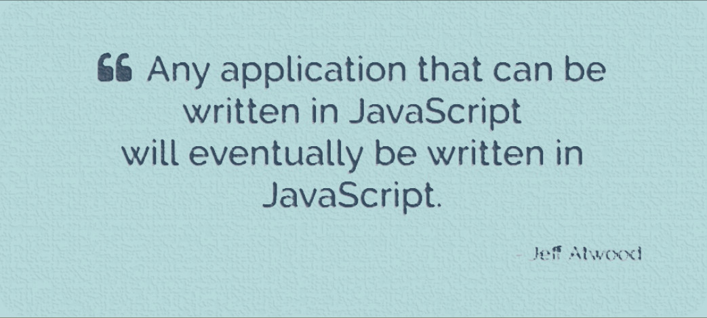

## JavaScript 应用越来越广泛

- Web 开发
  - 原生 JavaScript
  - React 开发
  - Vue 开发
  - Angular 开发
- 移动端开发
  - ReactNative
  - Weex
- 小程序端开发
  - 微信小程序
  - 支付宝小程序
  - uniapp
  - taro
- 桌面应用开发
  - Electron
  - 比如 VSCode
- 后端开发
  - Node 环境
  - 比如 express、koa、egg.js

## JavaScript 让人迷惑的知识点

- 作用域: 作用域的理解、作用域提升、块级作用域、作用域链、AO、GO、VO 等概念
- 函数、闭包: 闭包的访问规则、闭包的内存泄露、函数中 this 的指向
- 面向对象: JavaScript 面向对象、继承、原型、原型链等
- ES 新特性: ES6、7、8、9、10、11、12 新特性
- 其他一系列知识: 事件循环、微任务、宏任务、内存管理、Promise、await、asnyc、防抖、节流等等

## TypeScript 会取代 JavaScript 吗？

TypeScript 只是给 JavaScript 带来了类型的思维。

因为 JavaScript 本身长期是没有对变量、函数参数等类型进行限制的； 这可能给我们的项目带来某种安全的隐患；

在之后的 JavaScript 社区中出现了一系列的类型约束方案：

- 2014 年，Facebook 推出了 flow 来对 JavaScript 进行类型检查；
- 同年，Microsoft 微软也推出了 TypeScript1.0 版本；
- 他们都致力于为 JavaScript 提供类型检查，而不是取代 JavaScript；

并且在 TypeScript 的官方文档有这么一句话：源于 JavaScript，归于 JavaScript！

- TypeScript 只是 JavaScript 的一个超级，在它的基础之上进行了扩展；
- 并且最终 TypeScript 还是需要转换成 JavaScript 代码才能真正运行的；

当然我们不排除有一天 JavaScript 语言本身会加入类型检测，那么无论是 TypeScript，还是 Flow 都会退出历史舞台。

## JavaScript 是一门编程语言

为什么这里我要强调 JavaScript 是一门编程语言呢？很多同学想，我还不知道 JavaScript 是一门编程语言吗？

事实上我们可以使用更加准备的描述是这样：**JavaScript 是一门高级的编程语言。**

那么有高级编程语言，就有低级编程语言，从编程语言发展历史来说，可以划分为三个阶段：

- 机器语言：1000100111011000，一些机器指令；
- 汇编语言：mov ax,bx，一些汇编指令；
- 高级语言：C、C++、Java、JavaScript、Python；

但是计算机它本身是不认识这些高级语言的，所以我们的代码最终还是需要被转换成机器指令：

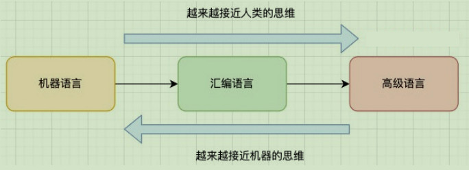

## 浏览器的工作原理

大家有没有深入思考过：JavaScript 代码，在浏览器中是如何被执行的？

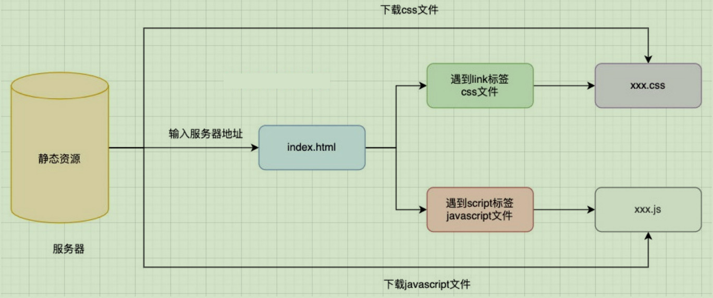

## 认识浏览器的内核

我们经常会说：不同的浏览器有不同的内核组成

- Gecko：早期被 Netscape 和 Mozilla Firefox 浏览器浏览器使用；
- Trident：微软开发，被 IE4~IE11 浏览器使用，但是 Edge 浏览器已经转向 Blink；
- Webkit：苹果基于 KHTML 开发、开源的，用于 Safari，Google Chrome 之前也在使用；
- Blink：是 Webkit 的一个分支，Google 开发，目前应用于 Google Chrome、Edge、Opera 等；
- 等等...

事实上，我们经常说的浏览器内核指的是浏览器的排版引擎：排版引擎（layout engine），也称为浏览器引擎（browser engine）、页面渲染引擎（rendering engine）
或样版引擎。

## 浏览器渲染过程

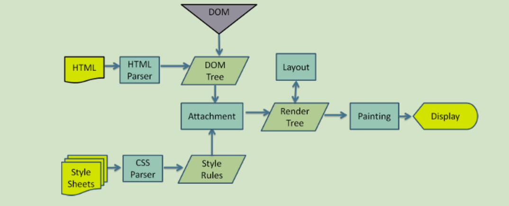

但是在这个执行过程中，HTML 解析的时候遇到了 JavaScript 标签，应该怎么办呢？ 会停止解析 HTML，而去加载和执行 JavaScript 代码；那么，JavaScript 代码由谁来执行呢？JavaScript 引擎

## 认识 JavaScript 引擎

为什么需要 JavaScript 引擎呢？

我们前面说过，高级的编程语言都是需要转成最终的机器指令来执行的；事实上我们编写的 JavaScript 无论你交给浏览器或者 Node 执行，最后都是需要被 CPU 执行的；但是 CPU 只认识自己的指令集，实际上是机器语言，才能被 CPU 所执行；所以我们需要 JavaScript 引擎帮助我们将 JavaScript 代码翻译成 CPU 指令来执行；

比较常见的 JavaScript 引擎有哪些呢？

- SpiderMonkey：第一款 JavaScript 引擎，由 Brendan Eich 开发（也就是 JavaScript 作者）；
- Chakra：微软开发，用于 IT 浏览器；
- JavaScriptCore：WebKit 中的 JavaScript 引擎，Apple 公司开发；
- V8：Google 开发的强大 JavaScript 引擎，也帮助 Chrome 从众多浏览器中脱颖而出；
- 等等…

## 浏览器内核和 JS 引擎的关系

这里我们先以 WebKit 为例，WebKit 事实上由两部分组成的：

- WebCore：负责 HTML 解析、布局、渲染等等相关的工作；
- JavaScriptCore：解析、执行 JavaScript 代码；

看到这里，学过小程序的同学有没有感觉非常的熟悉呢？在小程序中编写的 JavaScript 代码就是被 JSCore 执行的；

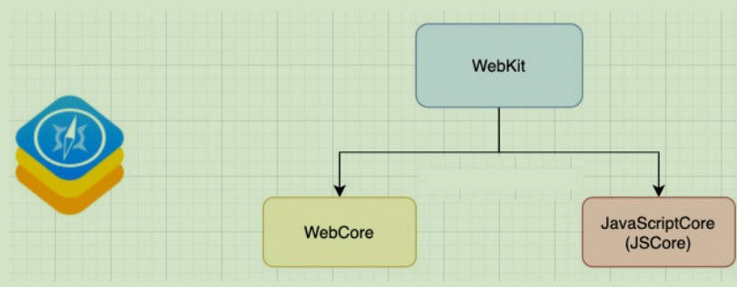
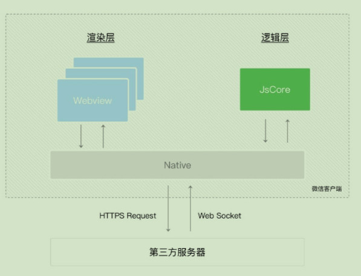

另外一个强大的 JavaScript 引擎就是 V8 引擎。

## V8 引擎的原理

我们来看一下官方对 V8 引擎的定义：

V8 是用 C ++编写的 Google 开源高性能 JavaScript 和 WebAssembly 引擎，它用于 Chrome 和 Node.js 等。它实现 ECMAScript 和 WebAssembly，并在 Windows 7 或更高版本，macOS 10.12+和使用 x64，IA-32，
ARM 或 MIPS 处理器的 Linux 系统上运行。V8 可以独立运行，也可以嵌入到任何 C ++应用程序中


## V8 引擎的架构

V8 引擎本身的源码非常复杂，大概有超过 100w 行 C++代码，通过了解它的架构，我们可以知道它是如何对 JavaScript 执行的：

- Parse 模块会将 JavaScript 代码转换成 AST（抽象语法树），这是因为解释器并不直接认识 JavaScript 代码；
  - 如果函数没有被调用，那么是不会被转换成 AST 的；
  - Parse 的 V8 官方文档：[https://v8.dev/blog/scanner](https://v8.dev/blog/scanner)
- Ignition 是一个解释器，会将 AST 转换成 ByteCode（字节码）
  - 同时会收集 TurboFan 优化所需要的信息（比如函数参数的类型信息，有了类型才能进行真实的运算）
  - 如果函数只调用一次，Ignition 会执行解释执行 ByteCode；
  - gnition 的 V8 官方文档：[https://v8.dev/blog/ignition-interpreter](https://v8.dev/blog/ignition-interpreter)
- TurboFan 是一个编译器，可以将字节码编译为 CPU 可以直接执行的机器码；
  - 如果一个函数被多次调用，那么就会被标记为热点函数，那么就会经过 TurboFan 转换成优化的机器码，提高代码的执行性能；
  - 但是，机器码实际上也会被还原为 ByteCode，这是因为如果后续执行函数的过程中，类型发生了变化（比如 sum 函数原来执行的是
    number 类型，后来执行变成了 string 类型），之前优化的机器码并不能正确的处理运算，就会逆向的转换成字节码；
  - TurboFan 的 V8 官方文档：[https://v8.dev/blog/turbofan-jit](https://v8.dev/blog/turbofan-jit)

## V8 引擎的解析图（官方）

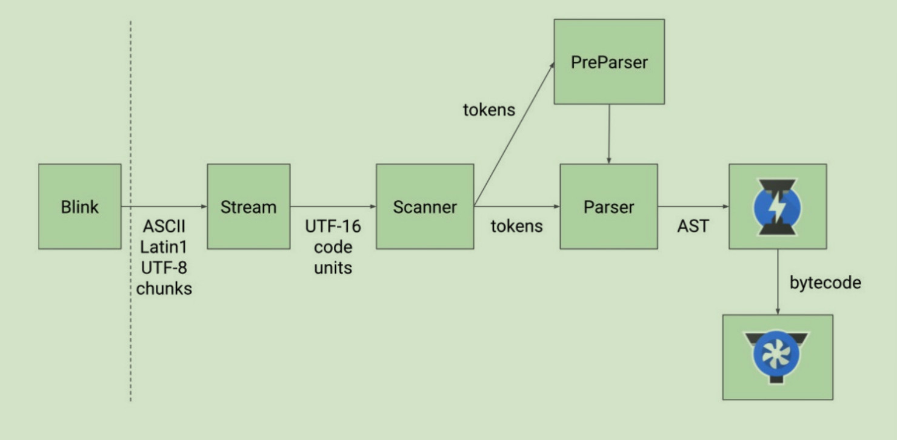

## V8 执行的细节

那么我们的 JavaScript 源码是如何被解析（Parse 过程）的呢？

- Blink 将源码交给 V8 引擎，Stream 获取到源码并且进行编码转换;
- Scanner 会进行词法分析（lexical analysis），词法分析会将代码转换成 tokens；
- 接下来 tokens 会被转换成 AST 树，经过 Parser 和 PreParser：
  - Parser 就是直接将 tokens 转成 AST 树架构；
  - PreParser 称之为预解析，为什么需要预解析呢？
    这是因为并不是所有的 JavaScript 代码，在一开始时就会被执行。那么对所有的 JavaScript 代码进行解析，必然会 影响网页的运行效率；所以 V8 引擎就实现了 Lazy Parsing（延迟解析）的方案，它的作用是将不必要的函数进行预解析，也就是只解析暂
    时需要的内容，而对函数的全量解析是在函数被调用时才会进行；比如我们在一个函数 outer 内部定义了另外一个函数 inner，那么 inner 函数就会进行预解析；
- 生成 AST 树后，会被 Ignition 转成字节码（bytecode），之后的过程就是代码的执行过程（后续会详细分析）

## JavaScript 的执行过程

假如我们有下面一段代码，它在 JavaScript 中是如何被执行的呢？

```js
var name = "why";

function foo() {
  var name = "foo";
  console.log(name);
}

var num1 = 20;
var num2 = 30;
var result = num1 + num2;

console.log(result);

foo();
```

## 初始化全局对象

js 引擎会在执行代码之前，会在堆内存中创建一个全局对象：Global Object（GO）; 该对象 所有的作用域（scope）都可以访问；里面会包含 Date、Array、String、Number、setTimeout、setInterval 等等；其中还有一个 window 属性指向自己；

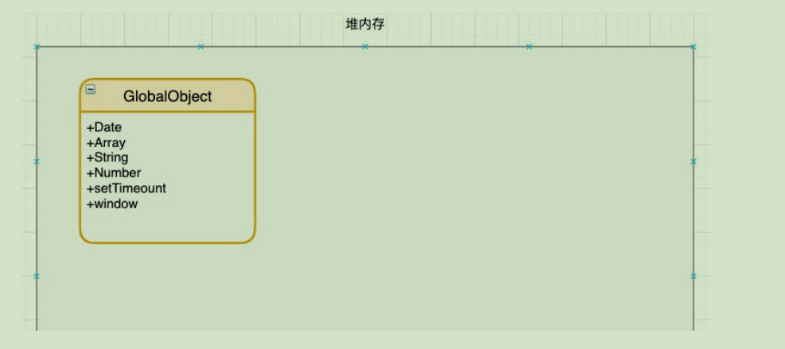

## 执行上下文栈（调用栈）

js 引擎内部有一个执行上下文栈（Execution Context Stack，简称 ECS），它是用于执行代码的调用栈。那么现在它要执行谁呢？执行的是全局的代码块：

- 全局的代码块为了执行会构建一个 Global Execution Context（GEC）；
- GEC 会 被放入到 ECS 中 执行；

GEC 被放入到 ECS 中里面包含两部分内容：

第一部分：在代码执行前，在 parser 转成 AST 的过程中，会将全局定义的变量、函数等加入到 GlobalObject 中，
但是并不会赋值；这个过程也称之为变量的作用域提升（hoisting）

第二部分：在代码执行中，对变量赋值，或者执行其他的函数；

## GEC 被放入到 ECS 中

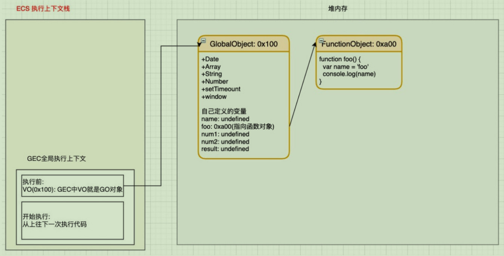

## GEC 开始执行代码

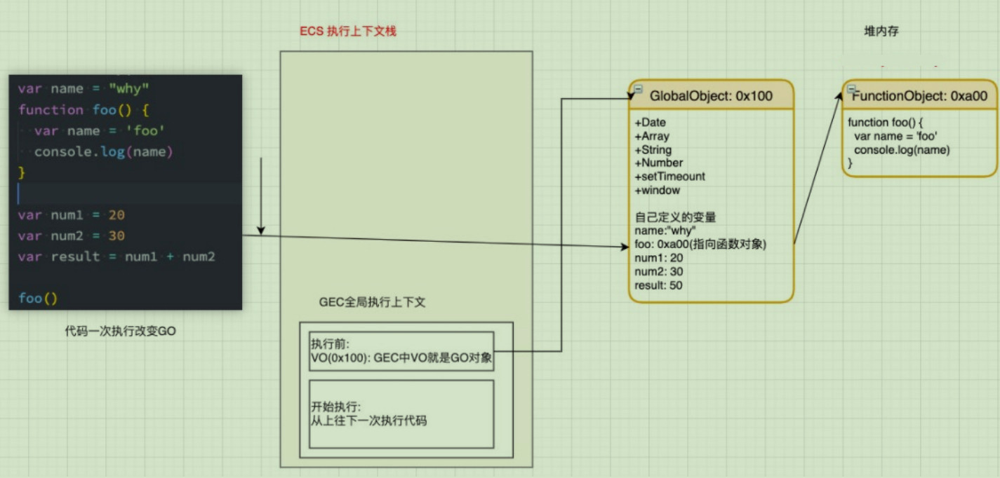

## 遇到函数如何执行？

在执行的过程中执行到一个函数时，就会根据函数体创建一个函数执行上下文（Functional Execution Context，
简称 FEC），并且压入到 EC Stack 中

FEC 中包含三部分内容：

- 第一部分：在解析函数成为 AST 树结构时，会创建一个 Activation Object（AO）：
  AO 中包含形参、arguments、函数定义和指向函数对象、定义的变量；
- 第二部分：作用域链：由 VO（在函数中就是 AO 对象）和父级 VO 组成，查找时会一层层查找；
- 第三部分：this 绑定的值：这个我们后续会详细解析；

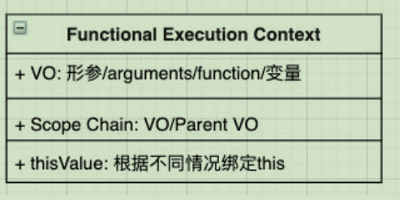

## FEC 被放入到 ECS 中

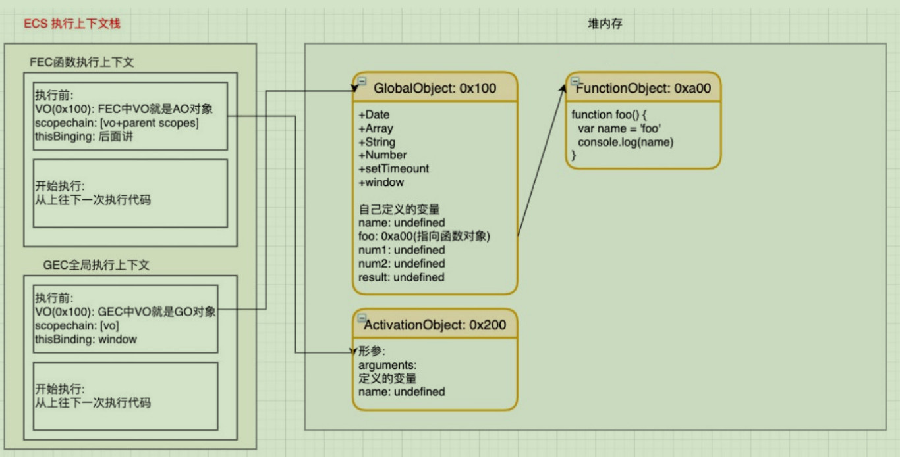

## FEC 开始执行代码

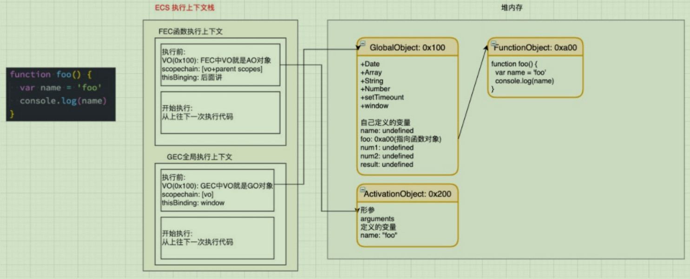

## 变量环境和记录

其实我们上面的讲解都是基于早期 ECMA 的版本规范：


在最新的 ECMA 的版本规范中，对于一些词汇进行了修改：


通过上面的变化我们可以知道，在最新的 ECMA 标准中，我们前面的变量对象 VO 已经有另外一个称呼了变量环境
VE。

## 作用域提升面试题

面试 1

```js
var n = 100;
function foo() {
  n = 200;
}

foo();

console.log(n);
```

面试 2

```js
function foo() {
  console.log(n);
  var n = 200;
  console.log(n);
}

var n = 100;

foo();
```

面试 3

```js
var a = 100;

function foo() {
  console.log(a);
  return;
  var a = 100;
}

foo();
```

面试 4

```js
function foo() {
  var a = (b = 99);
}

foo();

console.log(a);
console.log(b);
```

面试 5

```js
function foo() {
  var a = (b = 99);
}

foo();

console.log(a);
console.log(b);
```
